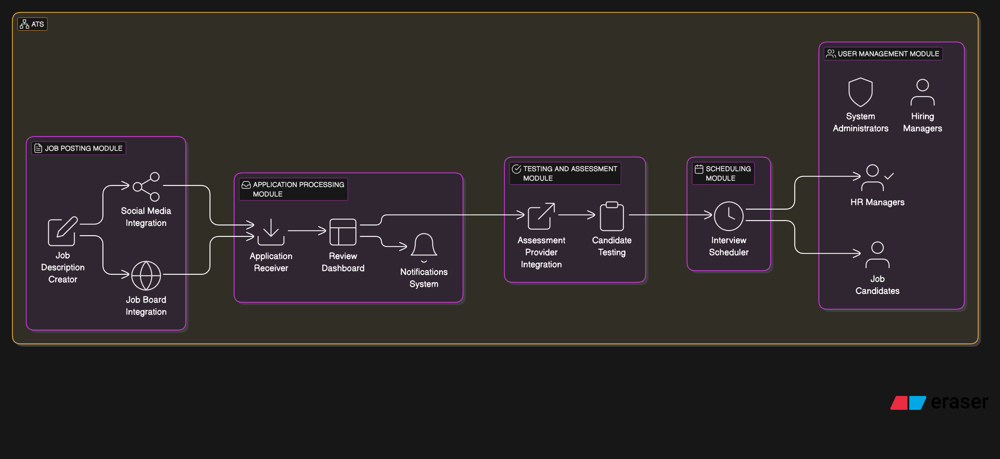

**LTI Applicant Tracking System (ATS) Overview**

### **Brief Description**
LTI is an Applicant Tracking System (ATS) designed to streamline and enhance the hiring process for companies and HR professionals. It provides an end-to-end recruitment workflow, from job posting to final hiring, ensuring efficiency, transparency, and better candidate selection.

### **Added Value & Competitive Advantages**
1. **Efficiency:** Automates job postings, candidate screening, and interview scheduling.
2. **Better Candidate Quality:** Built-in capacity tests help HR teams select the best-fit candidates.
3. **Seamless Collaboration:** Enables HR teams and hiring managers to work together on candidate evaluations.
4. **Integration with Social Media & Job Boards:** Expands job reach and increases applicant volume.
5. **AI-Powered Insights:** Provides analytics to optimize hiring strategies.

### **Key Features**
- **Job Posting & Social Media Integration:** HR professionals can create and distribute job descriptions.
- **Candidate Application Management:** Tracks applications and provides structured candidate profiles.
- **Automated Candidate Screening:** Uses customizable filters and tests to shortlist candidates.
- **Built-in Assessment Tests:** Candidates complete competency exams within the platform.
- **Interview Scheduling System:** Automatically coordinates meetings with shortlisted candidates.
- **Hiring Decision Support:** Aggregates all candidate evaluations for informed decision-making.
- **Analytics & Reporting:** Provides HR teams with insights into hiring efficiency and performance.

---
### **Lean Canvas: Business Model Overview**

**Problem:**
- Lengthy and inefficient hiring processes.
- Poor candidate filtering leading to bad hires.
- Limited insights for HR decision-making.

**Customer Segments:**
- Small to large enterprises with active hiring needs.
- HR professionals and hiring managers.

**Unique Value Proposition:**
- End-to-end hiring automation with AI-driven insights.
- Seamless candidate experience with integrated assessments.

**Solution:**
- A centralized ATS that automates job postings, filtering, testing, and hiring workflows.

**Revenue Streams:**
- Subscription-based SaaS model with different tiers.
- Premium features such as AI-enhanced analytics and custom integrations.

**Channels:**
- Direct sales to HR departments.
- Online marketing and partnerships with job boards.

**Key Metrics:**
- Number of job postings and applications.
- Time-to-hire reduction.
- User engagement and satisfaction.

**Cost Structure:**
- Development and maintenance.
- Cloud infrastructure.
- Marketing and customer acquisition.

**Unfair Advantage:**
- AI-powered candidate ranking and predictive hiring analytics.
- Seamless integration with major job platforms and HR software.

---

### **Main Use Cases & Diagrams**

#### **Use Case 1: Job Posting & Candidate Application**
**Actors:** HR Manager, Candidate
**Flow:**
1. HR Manager creates and publishes a job description.
2. The job is shared on social media and job boards.
3. Candidates find and apply for the job.
4. The system stores candidate applications for HR review.

**Sequence Diagram:**
```
HR Manager -> System: Create Job Description
System -> Social Media/Job Boards: Publish Job Posting
Candidate -> System: Apply for Job
System -> HR Manager: Store and Display Application
```

#### **Use Case 2: Candidate Screening & Testing**
**Actors:** HR Manager, Candidate, System
**Flow:**
1. The system filters candidates based on predefined criteria.
2. Selected candidates receive capacity test invitations.
3. Candidates complete the test.
4. The system evaluates results and ranks candidates.

**Sequence Diagram:**
```
System -> HR Manager: Display Filtered Candidates
HR Manager -> System: Select Candidates for Test
System -> Candidate: Send Test Invitation
Candidate -> System: Complete Test
System -> HR Manager: Rank and Display Results
```

#### **Use Case 3: Interview Scheduling & Hiring**
**Actors:** HR Manager, Candidate, System
**Flow:**
1. HR selects candidates for interviews.
2. The system offers available time slots to candidates.
3. Candidate selects a slot, and the system schedules the meeting.
4. After the interview, HR updates hiring decisions in the system.
5. The system finalizes the hiring process and notifies the selected candidate.

**Sequence Diagram:**
```
HR Manager -> System: Select Candidates for Interview
System -> Candidate: Send Available Time Slots
Candidate -> System: Select Time Slot
System -> HR Manager: Schedule Interview
HR Manager -> System: Update Hiring Decision
System -> Candidate: Send Hiring Confirmation
```

---

### **Data Model**

#### **Entities & Attributes**

1. **JobPosting**
    - `id` (UUID, Primary Key)
    - `title` (String)
    - `description` (Text)
    - `location` (String)
    - `companyId` (UUID, Foreign Key -> Company)
    - `createdAt` (Timestamp)
    - `status` (Enum: OPEN, CLOSED)

2. **Company**
    - `id` (UUID, Primary Key)
    - `name` (String)
    - `industry` (String)
    - `location` (String)

3. **Candidate**
    - `id` (UUID, Primary Key)
    - `name` (String)
    - `email` (String, Unique)
    - `resume` (Text)
    - `appliedJobs` (List of JobPosting IDs)

4. **Application**
    - `id` (UUID, Primary Key)
    - `candidateId` (UUID, Foreign Key -> Candidate)
    - `jobId` (UUID, Foreign Key -> JobPosting)
    - `status` (Enum: PENDING, REJECTED, ACCEPTED)
    - `appliedAt` (Timestamp)

5. **Assessment**
    - `id` (UUID, Primary Key)
    - `applicationId` (UUID, Foreign Key -> Application)
    - `score` (Float)
    - `status` (Enum: PASSED, FAILED)

6. **Interview**
    - `id` (UUID, Primary Key)
    - `applicationId` (UUID, Foreign Key -> Application)
    - `interviewDate` (Timestamp)
    - `status` (Enum: SCHEDULED, COMPLETED)

7. **HiringDecision**
    - `id` (UUID, Primary Key)
    - `applicationId` (UUID, Foreign Key -> Application)
    - `decision` (Enum: HIRED, REJECTED)
    - `decisionDate` (Timestamp)

#### **Relationships**
- A **Company** has many **JobPostings**.
- A **Candidate** can apply for multiple **JobPostings**.
- A **JobPosting** can have multiple **Applications**.
- An **Application** may have one **Assessment**.
- An **Application** may have one or more **Interviews**.
- An **Application** may result in one **HiringDecision**.

#### **High-Level System Design**


#### **C4**

