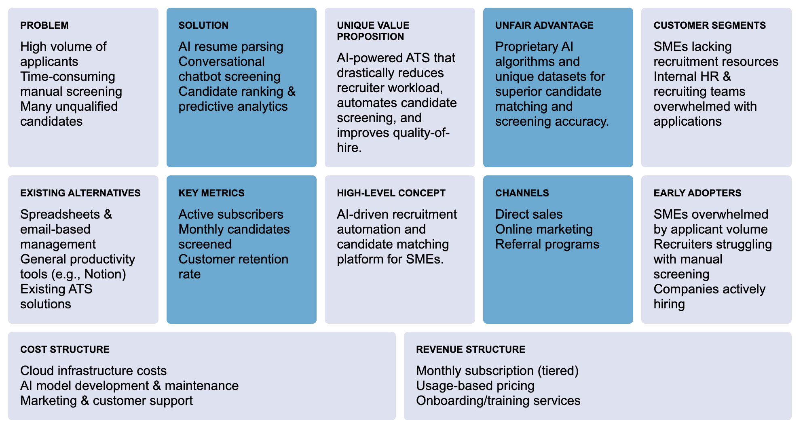
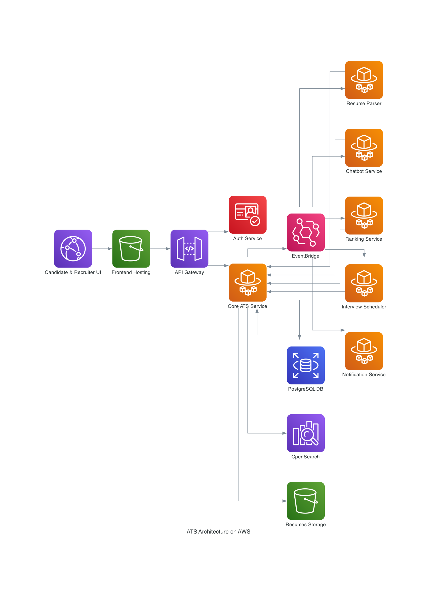

# ATS from LTI

## Mermaid!

```mermaid
graph TD
    subgraph Users & Front-end
        Candidate
        Recruiter
        HiringMgr[Hiring Manager]
        RecruiterDashboard[Recruiter Dashboard]
        CareerPage[Career Page]
        MobileApp[Mobile App]
    end

    subgraph ATS Core Application
        JobPosting[Job Posting & Distribution]
        CandidateMgmt[Candidate Pipeline Management]
        CommEngine[Integrated Communication]
        Scheduling[Interview Scheduling]
        TalentPool[Candidate Sourcing & Talent Pool]
        WorkflowAutomation[Workflow Automation]
        CareerPage[Career Page Builder]
    end

    subgraph AIEngine[AI & Analytics Engine]
        ResumeParser[Advanced Resume Parsing & Skill Extraction]
        Chatbot[Conversational AI Screening Chatbot]
        CandidateMatching[AI Candidate Matching & Scoring]
        VideoAnalysis[Video Interview Analysis]
        PredictiveAnalytics[Predictive Analytics]
        AnalyticsReporting[Analytics & Reporting]
    end

    subgraph Data Storage
        StructuredDB[(Structured Data DB)]
        UnstructuredDB[(Unstructured Data Storage)]
        SearchEngine[(Real-time Search Engine)]
    end

    subgraph Infrastructure
        API[REST API Layer]
        Containers[Containers & Kubernetes]
        CloudProvider["Cloud Infrastructure (AWS/Azure/GCP)"]
        CandidatePipeline[Candidate Pipeline]
        Compliance[GDPR & Compliance Management]
    end

    Candidate --> CareerPage
    Candidate --> Chatbot
    Recruiter --> RecruiterDashboard
    HiringMgr --> RecruiterDashboard

    CareerPage --> TalentPool
    CareerPage --> CandidateMgmt

    API --> CareerPage
    API --> RecruiterDashboard
    API --> MobileApp

    CandidateMgmt --> ResumeParser
    CandidateMgmt --> CandidatePipeline

    CandidatePipeline --> WorkflowAutomation
    CandidatePipeline --> CommEngine
    CandidatePipeline --> Scheduling

    JobPosting[Job Posting & Distribution] --> CandidateMgmt

    ResumeParser --> StructuredDB
    ResumeParser --> UnstructuredDB

    ResumeParser --> SearchEngine
    TalentPool --> SearchEngine

    CommEngine --> Candidate
    Scheduling --> Candidate

    AIEngine --> CandidateMgmt
    CandidateMgmt --> StructuredDB
    CandidateMgmt --> UnstructuredDB

    Infrastructure --> API
    Infrastructure --> AIEngine

    Compliance[Compliance & GDPR] --> StructuredDB
    Compliance --> UnstructuredDB

    Containers --> CloudProvider

    RecruiterDashboard --> API

    MobileApp --> API
```

## Lean Canvas

## Principal use cases

Explanation of this visual:
* Candidate uploads resume → ATS parses it → ATS screens and ranks candidate (AI-driven).
* Recruiter reviews AI-ranked candidates, selects candidates, and automates interview scheduling.
* Candidates are notified automatically of scheduled interviews.

## Entity-relationship diagram

```mermaid
erDiagram
    Candidate ||--o{ Application : "submits"
    JobPosting ||--o{ Application : "receives"
    Application ||--|| Resume : "includes"
    Candidate ||--o{ ScreeningResult : "has"
    Application ||--o{ ScreeningResult : "evaluated by"
    ScreeningResult ||--o{ Interview : "leads to"
    Recruiter ||--o{ Interview : "conducts"
    ChatSession ||--|| Candidate : "interacts with"
    ChatSession ||--o{ ScreeningResult : "produces"
    Interview ||--o{ Feedback : "generates"
    Recruiter ||--o{ Feedback : "provides"

    Candidate {
        UUID id
        string first_name
        string last_name
        string email
        string phone
        date applied_date
    }

    JobPosting {
        UUID id
        string title
        text description
        date posted_date
        string status
    }

    Application {
        UUID id
        UUID candidate_id
        UUID job_posting_id
        datetime applied_on
        string status
    }

    Resume {
        UUID id
        UUID application_id
        text parsed_content
        string file_path
        datetime parsed_date
    }

    ScreeningResult {
        UUID id
        UUID application_id
        float ai_score
        string ai_comments
        datetime screened_date
    }

    ChatSession {
        UUID id
        UUID candidate_id
        text transcript
        datetime started_at
        datetime ended_at
    }

    Interview {
        UUID id
        UUID screening_result_id
        UUID recruiter_id
        datetime scheduled_time
        string interview_mode
    }

    Recruiter {
        UUID id
        string first_name
        string last_name
        string email
    }

    Feedback {
        UUID id
        UUID interview_id
        UUID recruiter_id
        text comments
        datetime feedback_date
    }
```

Key Relationships:
* Candidate applies through an Application for a specific JobPosting.
* Resume is attached to each Application.
* ChatSession generates initial ScreeningResults.
* ScreeningResults lead to Interviews conducted by Recruiters.
* Recruiters provide Feedback after Interviews.

## System architecture

